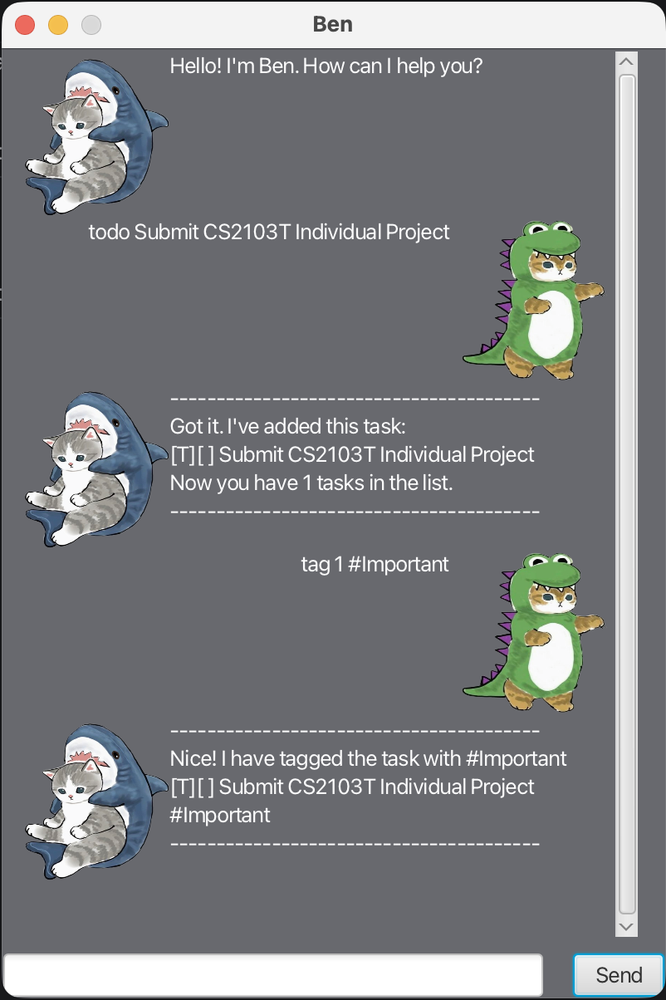

# Ben User Guide



Ben is a chatbot-like application with a Graphical User Interface (GUI).  
It allows users to manage tasks efficiently using simple command-based inputs.

## Features

Ben supports:

- ToDo tasks
- Deadline tasks
- Event tasks
- Marking and unmarking tasks
- Deleting tasks
- Finding tasks
- Tagging and untagging tasks
- Automatic data saving

---

## Adding Tasks

### Adding a ToDo Task: `todo`

Adds a simple task without any date.

**Format:**  
`todo DESCRIPTION`

**Example:**  
`todo submit assignment`

**Expected output:**
```
Got it. I've added this task:
[T][ ] submit assignment
Now you have 1 task in the list.
```

---

### Adding a Deadline Task: `deadline`

Adds a task that needs to be completed by a specific date.  
Date specified in `/by` is required and should follow the format `YYYY-MM-DD`.

**Format:**  
`deadline DESCRIPTION /by DATE`

**Example:**  
`deadline read book /by 2026-02-19`

**Expected output:**
```
Got it. I've added this task:
[D][ ] read book (by: Feb 19 2026)
Now you have 2 tasks in the list.
```

---

### Adding an Event Task: `event`

Adds a task that occurs during a specific date or time range.

**Format:**  
`event DESCRIPTION /from START /to END`

**Example:**  
`event meeting /from 2026-01-01 /to 2026-01-02`

**Expected output:**
```
Got it. I've added this task:
[E][ ] meeting (from: 2026-01-01 to: 2026-01-02)
Now you have 3 tasks in the list.
```

---

## Listing All Tasks: `list`

Displays all tasks in your task list.

**Format:**  
`list`

**Expected output:**
```
Here are the tasks in your list
1. [T][ ] submit assignment
2. [D][ ] read book (by: Feb 19 2026)
3. E][ ] meeting (from: 2026-01-01 to: 2026-01-02)
```

---

## Marking a Task as Done: `mark`

Marks a specific task as completed.

**Format:**  
`mark TASK_NUMBER`

**Example:**  
`mark 1`

**Expected output:**
```
Got it. I've marked task 1 as done:
[T][X] submit assignment
```

---

## Unmarking a Task: `unmark`

Marks a specific task as not completed.

**Format:**  
`unmark TASK_NUMBER`

**Example:**  
`unmark 1`

**Expected output:**
```
Got it. I've unmarked task 1
[T][ ] submit assignment
```

---

## Deleting a Task: `delete`

Removes a task from your task list.

**Format:**  
`delete TASK_NUMBER`

**Example:**  
`delete 2`

**Expected output:**
```
Noted. I've removed this task:
[D][ ] read book (by: Feb 19 2026)
Now you have 2 tasks in the list.
```

---

## Finding Tasks: `find`

Searches for tasks containing a specific keyword.

**Format:**  
`find KEYWORD`

**Example:**  
`find assignment`

**Expected output:**
```
Here are the matching tasks in your list:
1. [T][ ] submit assignment
```

---

## Tagging a Task: `tag`

Adds tags to your tasks for better organization.  
Tags are added at the end of the task description, prefixed with `#`.

**Format:**  
`tag TASK_NUMBER #label`

**Example:**  
`tag 1 #Important`

**Expected output:**
```
Nice! I have tagged the task with #Important
[T][ ] submit assignment #Important
```

---

## Untagging a Task: `untag`

Removes a tag from your task.

**Format:**  
`untag TASK_NUMBER #label`

**Example:**  
`untag 1`

**Expected output:**
```
Nice! I have untagged the task 1
[T][ ] submit assignment
```

---

## Exiting the Program: `bye`

Exits the Ben application.

**Format:**  
`bye`

**Expected output:**
```
Bye. Hope to see you again soon!
```

---

## Command Summary

| Command  | Format |
|----------|--------|
| Todo     | `todo DESCRIPTION` |
| Deadline | `deadline DESCRIPTION /by DATE` |
| Event    | `event DESCRIPTION /from START /to END` |
| List     | `list` |
| Mark     | `mark TASK_NUMBER` |
| Unmark   | `unmark TASK_NUMBER` |
| Delete   | `delete TASK_NUMBER` |
| Tag      | `tag TASK_NUMBER #label` |
| Untag    | `untag TASK_NUMBER #label` |
| Find     | `find KEYWORD` |
| Exit     | `bye` |

---

## Notes

- Task numbers start from 1.
- Date format for deadlines should follow: `YYYY-MM-DD`.
- Tasks are automatically saved to `data/ben.txt` after each operation.
- If an invalid command is entered, Ben will display an appropriate error message.
- If the data file cannot be found, Ben will create a new empty data file automatically.